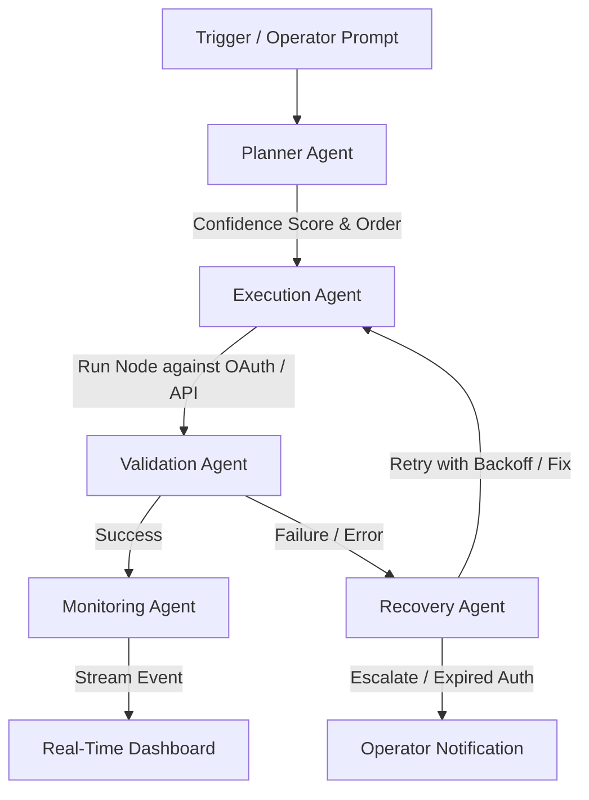

# AgentFlow AI 🚀
### Agentic AI Operations Automation Platform

AgentFlow AI is a powerful, full-stack AI Operations Automation Platform that allows operators to describe complex workflows in natural language and transform them into executable visual automation graphs. 

Similar to n8n or Zapier, AgentFlow AI features a drag-and-drop canvas powered by React Flow, but introduces an **explicit multi-agent orchestration layer** (Planner, Execution, Validation, Recovery, and Monitoring agents) that dynamically executes and recovers from failures in real time.

---

## 🎨 System Architecture & Agent Chain

When a workflow execution is triggered, the engine coordinates the run through a cooperation-based chain of AI agents:



* **Planner Agent**: Decides the execution order of nodes and emits confidence metrics.
* **Execution Agent**: Resolves integration actions and triggers the respective third-party SDKs or LLM steps.
* **Validation Agent**: Checks required input/output contracts to ensure correct execution.
* **Recovery Agent**: Classifies errors (e.g. rate limit, expired credentials, network failures) and decides on retry backoffs or human escalation.
* **Monitoring Agent**: Emits execution progress and status logs to the Socket.IO server.

---

## 🛠️ Technology Stack

### Frontend (Client)
* **Framework:** Next.js (Pages Router) & React 19
* **Styling:** Tailwind CSS & Lucide Icons
* **State Management:** Zustand
* **Visual Graph Canvas:** React Flow (`@xyflow/react`)
* **Real-time Communication:** Socket.IO Client & Axios

### Backend (Server)
* **Framework:** Node.js & Express
* **Database:** MongoDB & Mongoose (with automated in-memory SQLite/MongoMemoryServer fallback)
* **Queuing & Scheduling:** BullMQ on Redis (via ioredis)
* **Real-time Server:** Socket.IO
* **Security:** JSON Web Tokens (JWT), Helmet, Morgan, Express Validator, Bcrypt.js (cost 12), and AES-256 application-level credential encryption.

---

## ✨ Key Features

1. **AI-Driven Graph Generation:**
   * Natural language prompt to workflow conversion.
   * Auto-resolves models using OpenRouter (primary), Google Gemini (fallback), or a rule-based graph builder (no-key fallback).
2. **Interactive Canvas Builder:**
   * Drag-and-drop React Flow builder with a node palette.
   * Interactive side panel to configure fields, inputs, and integrations.
3. **Robust OAuth & Integrations:**
   * Seamless OAuth flows for Gmail, Slack, Discord, and Google Sheets.
   * Cryptographically secure credential encryption at rest.
4. **Real-Time Observability Logs:**
   * Live timeline streams showing agent steps, execution duration, and node states.
   * Instant success, retry, failure, and auth warning indicators.
5. **Smart Error Recovery & Backoff:**
   * Categorized errors and automated retry logic with exponential backoff handling using BullMQ queues.

---

## 📁 Repository Structure

```text
├── client/                 # Next.js Frontend Application
│   ├── src/
│   │   ├── components/     # AppShell, MetricGrid, ProtectedRoute, WorkflowCanvas, NodeConfigPanel
│   │   ├── lib/            # Axios instance, Socket client configuration
│   │   ├── store/          # Zustand auth and workflow state stores
│   │   └── pages/          # Next.js Pages (Builder, Dashboard, Executions, Integrations)
│   └── package.json
│
├── server/                 # Express Backend API & Agent Engine
│   ├── src/
│   │   ├── config/         # Environment variables, MongoDB database, Socket.IO setup
│   │   ├── controllers/    # API Request handlers (Auth, Workflow, Executions, Integrations)
│   │   ├── routes/         # Express endpoints with express-validator middleware
│   │   ├── services/       # Core business logic, OAuth, AI generation
│   │   ├── middleware/     # Auth checks, error handling
│   │   ├── models/         # Mongoose schemas (User, Workflow, Execution, ExecutionLog, Integration)
│   │   └── agents/         # Planner, Execution, Validation, Recovery, and Orchestrator modules
│   └── package.json
│
├── .env.example            # Environment configuration template
└── spec.md                 # Complete platform specifications
```

---

## ⚡ Quickstart Guide

### Prerequisites
* [Node.js](https://nodejs.org/) (v18+ recommended)
* [MongoDB](https://www.mongodb.com/) (Optional: the backend automatically falls back to an in-memory Mongo server if MongoDB Atlas/Local connection is absent)
* [Redis](https://redis.io/) (Optional: fallback scheduler runs in-memory if Redis is not configured)

---

### Step 1: Clone and Configure Environment

1. Copy `.env.example` to `.env` in the root directory:
   ```bash
   cp .env.example .env
   ```
2. Populate the parameters in `.env`:
   * **Database:** Add your `MONGODB_URI`
   * **AI Keys:** Add `OPENROUTER_API_KEY` or `GEMINI_API_KEY` to enable AI workflow generation.
   * **OAuth credentials:** Fill in Slack, Discord, or Google Client IDs for live integrations.

> [!TIP]
> The server and client are pre-configured to dynamically adapt to local development IPs (e.g. `http://192.168.x.x:3000`), allowing you to test the app on different local network devices (like mobile phones) seamlessly.

---

### Step 2: Start Backend Server

1. Navigate to the server folder:
   ```bash
   cd server
   ```
2. Install dependencies:
   ```bash
   npm install
   ```
3. Start the server in development mode:
   ```bash
   npm run dev
   ```
The backend server runs on `http://localhost:5000` (or your local IP port `5000`).

---

### Step 3: Start Frontend Client

1. Navigate to the client folder:
   ```bash
   cd ../client
   ```
2. Install dependencies:
   ```bash
   npm install
   ```
3. Run the Next.js development client:
   ```bash
   npm run dev
   ```
Open `http://localhost:3000` (or `http://YOUR_LOCAL_IP:3000`) in your browser to sign up and start building workflows!

---

## 🛡️ Security & Encryption

* **Auth**: Full session security using JWT tokens. User passwords are encrypted with `bcrypt` (work factor: 12) before saving to MongoDB.
* **Integrations**: Third-party credentials, OAuth access tokens, and refresh tokens are encrypted at rest using an AES-256-CBC cypher backed by the `CREDENTIAL_ENCRYPTION_KEY` in `.env`.
* **CORS**: Restricted origins map to `CLIENT_URL` (accepts multiple comma-separated URLs) to block malicious cross-origin requests.
